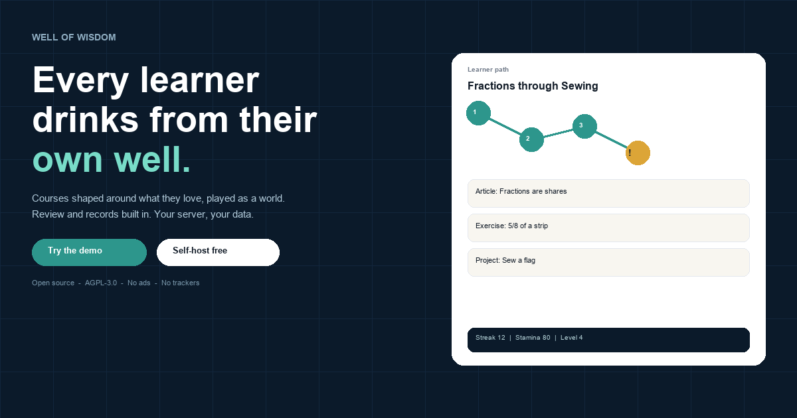
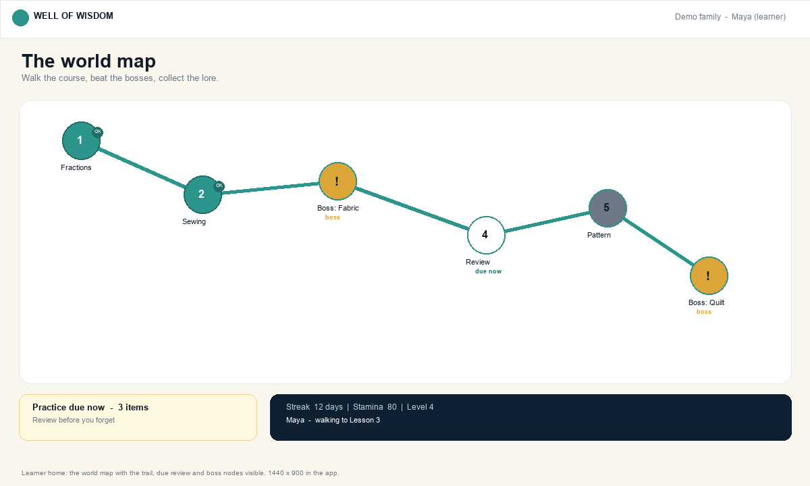
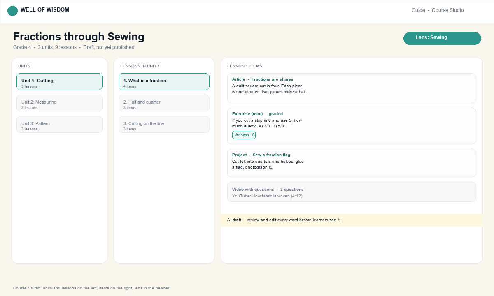
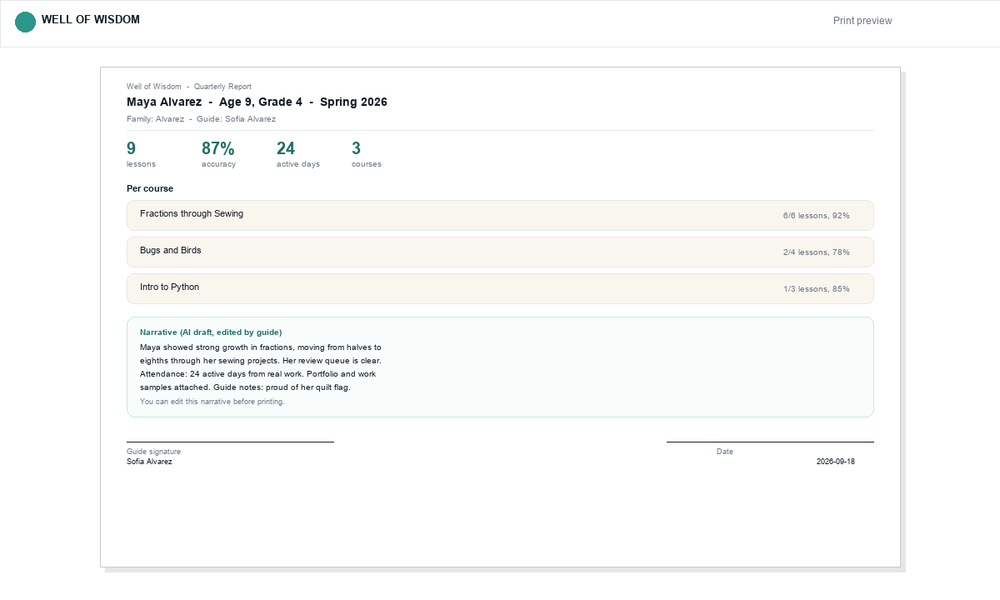

<div align="center">


# Well of Wisdom

**Open-source, AI-first learning for families, classrooms, schools, co-ops and tutors.**

Every learner drinks from their own well: courses shaped around what they love, played as a world, with review and records built in. Your server, your data.

[](LICENSE)
[](https://github.com/wellofwisdom/wellofwisdom/actions/workflows/ci.yml)
[](package.json)
[](CONTRIBUTING.md)

**Try the demo: [wellofwisdom.app](https://wellofwisdom.app) (no email, no invite). Or [self-host in 30 seconds](#self-host-in-30-seconds).**



*Demo video: 25 to 30 seconds of a learner walking the path and beating a boss. To record it, run `npm run dev` and `npm --prefix web run dev`, open the demo family as a learner at 1440x900, and capture two path nodes, one lesson with a right and wrong answer, and the boss win screen with ScreenToGif at 12 fps. Save as `web/public/demo.gif` under 8 MB (or `demo.mp4` with a video tag). Screenshots below show the same three views.*

</div>

</div>

---

## See it



The learner's world map. Walk the course as a trail, beat bosses with real answers, see what is due now. Travel animation, HUD and stamina bar visible in the app.



The Course Studio. Units on the left, lessons in the middle, items on the right. AI drafts every course, you review every word before learners see it. Lens shown in the header.



A printed quarterly report. Stats from real work, per course breakdown, an AI narrative you can edit, and signature lines for any reviewer. Generated for any date range.

---

## Why

In Irish mythology, nine hazel trees grow over the Well of Wisdom. Their nuts drop
into the water, and the Salmon of Knowledge eats them. One nut for each of the
worlds. The point of the myth: **wisdom doesn't come one way. It comes in many flavors.**

Khan Academy changed education, and it's free. But it's a walled garden: you can't
create your own courses, content gets retired, review isn't scheduled by memory
science, and your family's data lives on someone else's servers.

**Well of Wisdom is the alternative you own.**

## What it does

### 🧭 Learning paths: plan a whole semester or year
An AI assistant walks you through designing the arc (subject, goals, timeframe,
learners), then drafts the milestone sequence for your review. Or start from a
**built-in template**: Algebra 1, US History, Biology, Intro to Python, Creative
Writing, with **no AI key needed at all**. Each learner gets their own lens and
instructions on the same path.

### ✨ AI Course Studio: courses through what they love
Describe a topic, pick a lens, and get a full course (units, lessons, exercises,
projects) in about a minute. *"Fractions through sewing." "Physics through
skateboarding."* Ground it in your own sources (pasted text or links). Every
remembered note about a learner is applied automatically. You review and edit
every word before anyone sees it.

### 📝 Worksheets in, courses out
Paste any worksheet's text. The AI turns each question into a graded exercise
with an explanation and a hint. Paper curriculum becomes interactive.

### 🧠 Lessons that actually teach
Articles with real math (KaTeX), multiple choice, numeric answers that understand
`5/8` and `1 3/4`, written self-checks, YouTube videos with questions, hands-on
projects. Hints that nudge without telling. **"Why was I wrong?"**, an AI that
walks from the learner's mistake to the right idea. Read-aloud on every article.
Printable worksheets for screen-free days.

### 🔁 Spaced review: the memory-science advantage
Every graded exercise feeds a spaced-repetition scheduler (1 → 3 → 7 days, then
longer; mistakes return today). Learners get a "practice due now" queue across
all their courses. Most platforms don't do this at all.

### 📈 Progress that's real, reports that print
Live dashboards per learner (lessons, accuracy, active days). **Quarterly
reports** generated from real work: stats, per-course breakdown, an AI-written
narrative you can edit, printable with signature lines for any authority that
asks.

### 🗓️ Calendar & notifications
Events (sessions, deadlines, field trips, exams) merged with milestone target
dates on one month grid. **Weekly email digests** (each learner's week at a
glance) and **tomorrow-reminder emails**: via Resend, SparkPost, Amazon SES, or
your own SMTP, configured from the UI.

### 📚 A workspace, not a walled garden
A Notion-style free-form layer (nested pages, slash blocks, callouts, math) and
a resource library with four views (table, drag-and-drop board, calendar,
gallery). Export any course as a portable file; import courses from any other
instance: sharing between families needs no platform at all.

### 🔒 Yours
Self-hosted in one Docker command. Works with any OpenAI-compatible AI,
**Claude (Anthropic)**, **Gemini (Google)**, or **fully local Ollama**, so nothing
ever leaves your server if you don't want it to. AGPL-3.0. No accounts on our
servers, no tracking, no ads.

## Self-host in 30 seconds

```bash
git clone https://github.com/wellofwisdom/wellofwisdom.git
cd wellofwisdom
docker compose up -d
```

Open `http://localhost:3000`. The app and the database come up together. The
first account you create is the family owner, and nothing is created on our
servers, because there are none.

No AI key is needed for that command. Courses you generate need one; templates,
lessons, review, progress, reports, calendar and email all work without.

Latest image: `ghcr.io/wellofwisdom/wellofwisdom:latest` (and `v0.1.0`), so `docker pull` works once the release workflow has published it.

**Fully offline AI** (no cloud, no API keys):

```bash
docker compose --profile local-ai up -d
docker compose exec ollama ollama pull llama3.1
# then in .env:
#   AI_BASE_URL=http://ollama:11434/v1
#   AI_MODEL_PRO=llama3.1  AI_MODEL_FLASH=llama3.1
# Photo to worksheet with a local vision model:
#   docker compose exec ollama ollama pull llava
#   AI_VISION_MODEL=llava
```

Or point `AI_BASE_URL` at any OpenAI-compatible provider (DeepSeek, OpenAI, LM
Studio, …), use Claude (`AI_PROVIDER=anthropic` + `sk-ant-…` +
`claude-sonnet-4-5`), or use Gemini (`AI_PROVIDER=gemini` + Google AI
key + `gemini-2.0-flash`). See [`.env.example`](.env.example).
No AI key? Templates, lessons, review, progress, reports, calendar, and email
all still work.

## How it compares

| | Khan Academy | Moodle | Kolibri | **Well of Wisdom** |
|---|---|---|---|---|
| Self-hostable | ❌ | ✅ | ✅ | ✅ |
| AI course creation | ❌ | ❌ | ❌ | ✅ |
| Learn through your interests | ❌ | ❌ | ❌ | ✅ |
| Works with no AI key | ✅ | ✅ | ✅ | ✅ |
| Spaced review built in | ❌ | plugin | ❌ | ✅ |
| Kid-safe AI tutor | paid add-on | ❌ | ❌ | ✅ |
| Year-long curriculum planning | ❌ | manual | ❌ | ✅ |
| Reports built to print and sign | partial | ✅ | ❌ | ✅ |
| Configurable email digests | partial | ✅ | ❌ | ✅ |
| Course portability (export/import) | ❌ | ✅ | ❌ | ✅ |
| Works with fully local AI | ❌ | ❌ | n/a | ✅ |
| License | content CC BY-NC-SA | GPL-3.0 | MIT | **AGPL-3.0** |

Two cells say "partial" on purpose. Khan Academy does email a weekly progress
reminder to linked parent accounts, and its on-screen reports can be printed from
the browser. Here, a report is built to be printed and signed, and the digest is
per family: you choose the learners, the day, and the off switch. Kolibri is MIT
licensed, which is why it appears above. The licence row means the platform
itself; Khan Academy's own content carries its own terms.

## Roadmap

- [x] Foundation: auth, families, learners, Docker, AI routing
- [x] AI Course Studio + lesson player + explain-my-mistake
- [x] Spaced review + real progress tracking
- [x] Learning paths (AI + no-AI templates), per-learner lenses
- [x] Calendar, email digests, reminder emails
- [x] Quarterly reports (AI narrative, printable)
- [x] Worksheet import + course export/import
- [x] Workspace (Notion-style) + resource library (4 views)
- [x] Essay/project grading with rubrics (AI drafts feedback, a guide sends it back)
- [x] Photo → worksheet (snap the page, vision reads it to text you can correct)
- [x] Community course library, browsable and one tap to import, in the app
- [ ] Audio overviews (podcast-style unit summaries)
- [ ] Co-op mode: multiple guides, shared learners

Full detail in [`docs/ROADMAP.md`](docs/ROADMAP.md).

## Docs

| Doc | What is in it |
|---|---|
| [docs/API.md](docs/API.md) | Every route under `/api`: method, guard, body, response. Generated from the routes. |
| [docs/ARCHITECTURE.md](docs/ARCHITECTURE.md) | How the pieces fit, the trust boundary, and the five scale rules. |
| [docs/PEDAGOGY.md](docs/PEDAGOGY.md) | The research behind spaced review, self-explanation and tutor strictness, with citations. |
| [docs/OPERATIONS.md](docs/OPERATIONS.md) | Deploy checks, scratch database testing, backups, DNS. No secrets. |
| [docs/COMMUNITY-COURSES.md](docs/COMMUNITY-COURSES.md) | The course package format and how to contribute one. |
| [docs/LEARNING-PATHS.md](docs/LEARNING-PATHS.md) | Writing a year plan, with and without AI. |
| [docs/DESIGN.md](docs/DESIGN.md) | The two spaces, the accessibility bar, and the design system. |
| [docs/ROADMAP.md](docs/ROADMAP.md) | What is done, what is next, and why in that order. |
| [CHANGELOG.md](CHANGELOG.md) | What shipped, by day, in plain language. |

## Contributing

We'd love your help, especially guides (parents, teachers, tutors) and
developers. See [CONTRIBUTING.md](CONTRIBUTING.md) for the dev setup (Node 20,
`npm install`, `npm test`). Adding a curriculum template is one JSON file.

New to the project? [`docs/issues/`](docs/issues) holds twenty scoped tasks, each
with the file paths to touch and the checks that prove it works. Take one and
say so on the issue.

Be kind; read the [Code of Conduct](CODE_OF_CONDUCT.md).

## License & name

Code is licensed under the **GNU AGPL-3.0** ([LICENSE](LICENSE)): free for any
family, school, or co-op to run, forever. The name **"Well of Wisdom"** and the
project logo are reserved by the project: forks that diverge meaningfully
should rebrand, so the name always means the same thing to learners.
